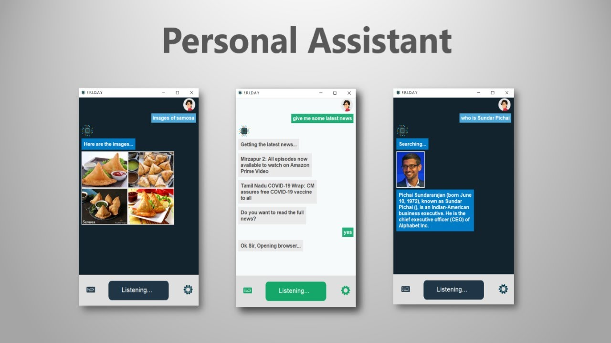

# PersonalAssistant
It is an Personal Assistant, capable to perform many tasks with some unique features, that you haven'e seen yet....  



## Features / Tasks it can perform:  
1. Game (eg, Rock Paper Scissor with GUI)  
2. Search anything from wikipedia, google maps, etc  
3. Play video from YouTube  
4. Email Sender  
5. WhatsApp Message Sender  
6. COVID Tracker  
7. Weather  
8. Jokes  
9. News  
10. High Security (Face Unlock)  
11. Capture Photo  
12. Math Calculations  
13. Timer  
14. In-built search image display  
15. Smart Dictionary Search  
16. OS Info, Battery Info  
17. Window, Tab Operations  
18. Opening Websites  
19. File Operations (Creating Files)  
20. Web Automation (HTML Project)    
21. Coin Toss, Roll Dice  
22. Translator  
23. ToDo List  
24. Directions on Map  
25. Screenshots  
26. Volume Control  

## Modules Requirements and Installation:  
  pip install SpeechRecognition  
  pip install pyttsx3  
  pip install playsound  
  pip install Pillow  
  pip install pyscreenshot  
  pip install pynput  
  pip install psutil  
  pip install opencv-contrib-python  
  pip install opencv  
  pip install wikipedia  
  pip install webbrowser  
  pip install bs4  
  pip install smtplib  
  pip install youtube_search  
  pip install wmi  
  pip install geopy  
  pip install googletrans==3.1.0a0  
  

## Math Calculations 
- What is the binary of 142?  
- 2 + 4 - 3 x 9  
- Right shift 4  
- What is the value of factorial 10?  
- What is the value of Sin 90?  
- 9 power 5  
- what is the log of 1000  

## Files Creation  
- Create a empty file  
- Create a Python file  
- Create a Java file  
- Create a PowerPoint file  

## Web Automation (HTML Project)  
- Create a HTML project -> Project Name  
(It will create Empty Project for you with HTML, CSS and JavaScript file with some important codes)  

## Google Maps Directions  
- Give me directions -> Starting Location -> Destination Location  

## Email Sender  
- Send an email -> Receiver Email -> Subject -> Message  

## WhatsApp Sender  
- Send a whatsapp message -> Receiver Phone No -> Message  

## COVID Tracker  
- What is the covid statistics?  
- What are the total covid cases in Inida?  
- What are the total deaths due to coronavirus?  
- What are the symptoms of covid-19?  
- What precautions can we take from coronavirus?  

## Translator  
- Translate a sentence -> "Hello, how are you?" -> Hindi  

## Smart Dictionary  
- What is the definition of Machine Learning?  
- What is the meaning of Natural Language Processing?  

## Timer  
- Set a timer for 10 seconds  
- Set a timer for 2 minutes  
- Set a timer for 1 minute 10 seconds  

## ToDo List  
- Add an item to my list -> "This is my first Item in my list"  
- Show my list  

## OS Info  
- Give my System Information  
- What's my battery life  

## Selfie / Photo Clicker  
- Take a Selfie  
- Click a Photo  

## Volume Control  
- Increase the Volume  
- Decrease the Volume  
- Mute the Volume  
- Full Volume  

## YouTube  
- Play Captain America Trailer on YouTube  
- Google I/O on YouTube  

## Image Result  
- Show the images of Robot  
- Show the images of Samosa  

## Wikipedia Result  
- Who is Sundar Pichai?  
- Who is Satya Nadella?  
- Artifical Intelligence on Wikipedia  

## Google Search  
- Search for new technologies  
- Search for data structures and algorithms  

## Google Maps  
- India on Google Maps  
- Washington DC on Google Maps  

## Joke Teller  
- Tell me a joke  
- Tell me a funny joke  

## News  
- Give me some news  
- Get the latest news  

## Weather  
- What is the weather?  

## ScreenShot  
- Take a ScreenShot  

## Window Operations  
- Open Window  
- Close Window 
- Switch Window  
- Maximize/Minimize Window  

## Tab Operations  
- Create new tab  
- Switch Tab  
- Close tab  

## System Apps  
- Open Paint  
- Open Notepad  
- Open Calculator  

## Automatic Typer  
- Open Notepad -> Say type " I'm currently not typing the text which I'm saying right now "
- Select All  
- Delete/Backspace  
- Save that  
- Press enter  

## Coin / Dice  
- Toss a coin  
- Roll a dice  

## Time / Date  
- What is the time?  
- What is the date today?  

## Voice Changer  
- Change your voice  
- Change your voice to Male/Female voice  

## Website Opener  
- Open GeekForGeeks  
- Open GitHub  
- Open CodeChef  

## Game  
- Let's play a game  
  - Rock Paper Scissor  
  - Online Games  
  
## Smart Reply  
- How are you?  
- Who are you?  
- Tell me something  
- When is your birthday?  
- You're so funny  
- Thank You  
- I'm sorry  


### To get started, run SECURITY.py file to register your face and to use it...  

##### Watch the demo here 👇👇👇
https://www.youtube.com/watch?v=tbw7VyBGSw0  

## Common Installation Issues  
```
pyaudio not installing  
  1. Download the pyaudio wheel version from https://www.lfd.uci.edu/~gohlke/pythonlibs/ (eg, if you have python version 3.7, download the file containing cp37)
  2. Install it using (eg, pip install PyAudio‑0.2.11‑cp37‑cp37m‑win_amd64.whl)
```

(USE PYTHON <= 3.8 WHICH SUPPORTS ALL THE LIBRARIES)
Raise an Issue ticket if you have any other problems  <br><br><br>

## Let's contribute together and make this chatbot to be more advanced AI Chatbot 🧐  

## Authors

 **roshan9419**

See also the list of [contributors](https://github.com/roshan9419/PersonalAssistantChatbot/graphs/contributors) who have participated in this project.

## License

This project is licensed under the MIT License - see the [LICENSE](LICENSE) file for details
